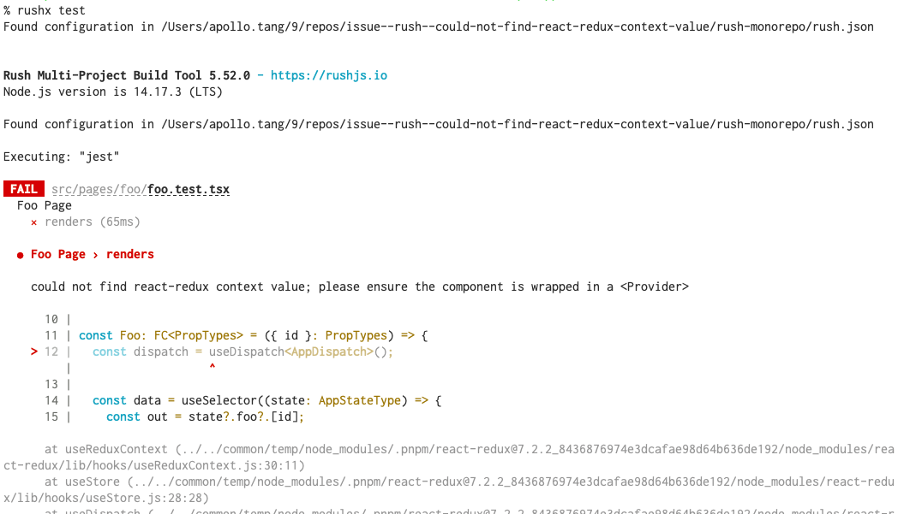

# Error when running jest


## Description

**Problem encountered:** 

When running integration test with react teating library, I would like to share my test bed among react applications. However, jest is running multiple instance of React-Redux in the dependency package, and you get the error :

```
could not find react-redux context value; please ensure the component is wrapped in a <Provider>
```

**Work around:** 

using module-resolver in babal so that we are always use React-Redux  in the consumer application. 


## Details





---


To reproduce the error comment out the the key:

```plugins --> module-resolver --> alias --> react-redux'  ```

in   `rush-monorepo/apps/client/babel.config.js`: 

```  const plugins = [
  const plugins = [
    '@babel/plugin-proposal-optional-chaining',
    ['@babel/plugin-proposal-decorators', { legacy: true }],
    ['@babel/plugin-proposal-class-properties', { loose: false }],
    '@babel/plugin-syntax-dynamic-import',
    isTest ? 'babel-plugin-dynamic-import-node' : null,
    'lodash',
    [
      'module-resolver',
      {
        alias: {
          // https://github.com/reduxjs/react-redux/issues/1631
          // https://github.com/microsoft/redux-dynamic-modules/issues/144
          // 'react-redux': path.resolve(
          //   __dirname,
          //   'node_modules/react-redux/lib'
          // ),
        },
      },
    ],
  ].filter(Boolean);
```


### Related Reference: 

https://github.com/reduxjs/react-redux/issues/1631 

https://github.com/microsoft/redux-dynamic-modules/issues/144 

https://penx.medium.com/managing-dependencies-in-a-node-package-so-that-they-are-compatible-with-npm-link-61befa5aaca7


